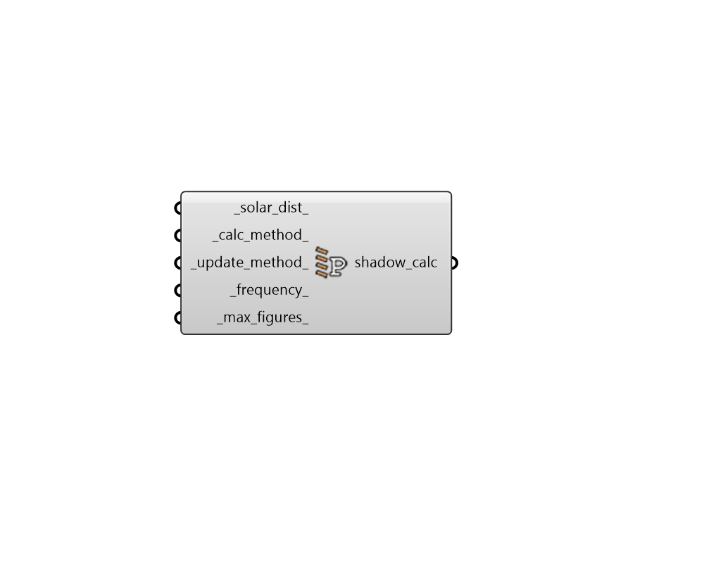

## Shadow Calculation

 - [[source code]](https://github.com/ladybug-tools/honeybee-grasshopper-energy/blob/master/honeybee_grasshopper_energy/src//HB%20Shadow%20Calculation.py)

Create settings for the EnergyPlus Shadow Calculation. 

#### Inputs
* ##### solar_dist 
An integer or text desribing how EnergyPlus should treat beam solar radiation and reflectances from surfaces that strike the building surfaces. Default is "FullExteriorWithReflections". Choose from the following. 

    * 0 = "MinimalShadowing" - In this case, exterior shadowing is only computedfor windows and not for other opaque surfaces that might have their surface temperature affected by the sun. All beam solar radiation entering the room is assumed to fall on the floor. A simple window view factor calculation is used to distribute incoming diffuse solar energy between interior surfaces. 

    * 1 = "FullExterior" - The simulation will perform the solar calculationin a manner that only accounts for direct sun and whether it is blocked by surrounding context geometry.  For the inside of the building, all beam solar radiation entering the room is assumed to fall on the floor. A simple window view factor calculation is used to distribute incoming diffuse solar energy between interior surfaces. 

    * 2 = "FullInteriorAndExterior" - The simulation will perform the solarcalculation in a manner that models the direct sun (and wheter it is blocked by outdoor context goemetry.  It will also ray trace the direct sun on the interior of rooms to distribute it correctly between interior surfaces.  Any indirect sun or sun bouncing off of objects will not be modled. Note that, if you use this method without setting the _calc_method_ to PixelCounting, EnergyPlus will give Severe warnings if your rooms have concave geometry (aka. are "L"-shaped). So it is recommended that this solar distribution only be used with the PixelCounting. 

    * 3 = "FullExteriorWithReflections" - [DEFAULT] The simulation will perform thesolar calculation in a manner that accounts for both direct sun and the light bouncing off outdoor surrounding context.  For the inside of the building, all beam solar radiation entering the room is assumed to fall on the floor. A simple window view factor calculation is used to distribute incoming diffuse solar energy between interior surfaces. 

    * 4 = "FullInteriorAndExteriorWithReflections" - The simulation will performthe solar calculation in a manner that accounts for light bounces that happen both outside and inside the rooms. This is the most accurate method but will take longer to run. Note that, if you use this method without setting the _calc_method_ to PixelCounting, EnergyPlus will give Severe warnings if your rooms have concave geometry (aka. are "L"-shaped). So it is recommended that this solar distribution only be used with the PixelCounting. 
* ##### calc_method 
Text noting whether CPU-based polygon clipping method or GPU-based pixel counting method should be used. For low numbers of shading surfaces (less than ~200), PolygonClipping requires less runtime than PixelCounting. However, PixelCounting runtime scales significantly better at higher numbers of shading surfaces. PixelCounting also has no limitations related to room concavity when used with any “FullInterior” solar distribution options. (Default: PolygonClipping). Choose from the following: 

    * PolygonClipping

    * PixelCounting
* ##### update_method 
Text describing how often the solar and shading calculations are updated with respect to the flow of time in the simulation. (Default: Periodic) Choose from the following: 

    * Periodic

    * Timestep
* ##### frequency 
Integer for the number of days in each period in which a unique shadow calculation will be performed. This field is only used if the AverageOverDaysInFrequency method is used in the previous field. Default - 30. 
* ##### max_figures 
Integer for the number of figures used in shadow overlaps. Default - 15000. 

#### Outputs
* ##### shadow_calc
A ShadowCalculation object that can be connected to the "HB Simulation Parameter" component in order to specify settings for the EnergyPlus Shadow Calculation. 