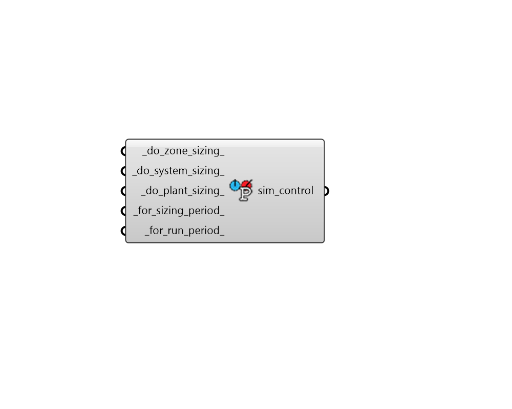

## Simulation Control

 - [[source code]](https://github.com/ladybug-tools/honeybee-grasshopper-energy/blob/master/honeybee_grasshopper_energy/src//HB%20Simulation%20Control.py)

Create simulation controls with instructions for which types of EnergyPlus calculations to run. 

#### Inputs
* ##### do_zone_sizing 
Boolean for whether the zone sizing calculation should be run. Default: True. 
* ##### do_system_sizing 
Boolean for whether the system sizing calculation should be run. Default: True. 
* ##### do_plant_sizing 
Boolean for whether the plant sizing calculation should be run. Default: True. 
* ##### for_sizing_period 
Boolean for whether the simulation should be run for the sizing periods. Default: False. 
* ##### for_run_period 
Boolean for whether the simulation should be run for the run periods. Default: True. 

#### Outputs
* ##### sim_control
A SimulationControl object that can be connected to the "HB Simulation Parameter" component in order to specify which types of EnergyPlus calculations to run. 