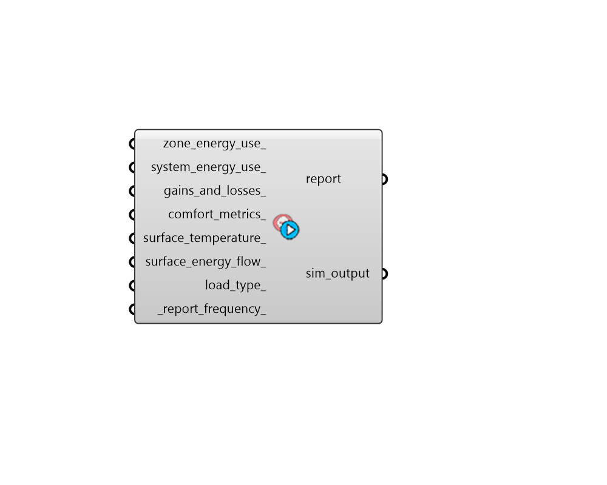

## Simulation Output

 - [[source code]](https://github.com/ladybug-tools/honeybee-grasshopper-energy/blob/master/honeybee_grasshopper_energy/src//HB%20Simulation%20Output.py)

Create a simulation output object by selecting sets of commonly-requested output variables. The resulting object can be used to request output variables from EnergyPlus. 

#### Inputs
* ##### zone_energy_use 
Set to True to add outputs for zone energy use when ideal air systems are assigned. This includes, ideal air heating + cooling, lighting, electric + gas equipment, and fan electric energy. 
* ##### system_energy_use 
Set to True to add outputs for HVAC energy use from detailed systems. This includes outputs for different pieces of HVAC equipment, which together catch all energy-consuming parts of a system. (eg. chillers, boilers, coils, humidifiers, fans, pumps). It also includes the energy use of components of Service Hot Water (SHW) systems as well as any electricity generated on site, such at that coming from photovoltaics. 
* ##### gains_and_losses 
Set to True to Add outputs for zone gains and losses. This includes such as people gains, solar gains, infiltration losses/gains, and ventilation losses/gains. 
* ##### comfort_metrics 
Set to True to add outputs for zone thermal comfort analysis. This includes air temperature, mean radiant temperature, relative humidity, and unmet setpoint time. 
* ##### surface_temperature 
Set to True to add outputs for indoor and outdoor surface temperature. 
* ##### surface_energy_flow 
Set to True to add outputs for energy flow across all surfaces. 
* ##### load_type 
An optional text value to set the type of load outputs requested. Default - 'All'. Choose from the following: 

    * All - all energy use including heat lost from the zone

    * Total - the total load added to the zone (both sensible and latent)

    * Sensible - the sensible load added to the zone

    * Latent - the latent load added to the zone
* ##### report_frequency 
Text for the frequency at which the outputs are reported. Default: 'Hourly'. Choose from the following: 

    * Annual

    * Monthly

    * Daily

    * Hourly

    * Timestep

#### Outputs
* ##### report
Report! 
* ##### sim_output
A SimulationOutput object that can be connected to the "HB Simulation Parameter" component in order to specify which types of outputs should be written from EnergyPlus. 