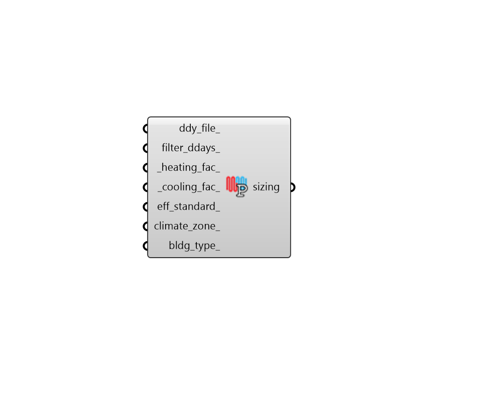

## Sizing Parameter

 - [[source code]](https://github.com/ladybug-tools/honeybee-grasshopper-energy/blob/master/honeybee_grasshopper_energy/src//HB%20Sizing%20Parameter.py)

Create parameters with criteria for sizing the heating and cooling system. 

#### Inputs
* ##### ddy_file 
An optional path to a .ddy file on your system, which contains information about the design days used to size the hvac system. If None, honeybee will look for a .ddy file next to the .epw and extract all 99.6% and 0.4% design days. 
* ##### filter_ddays 
Boolean to note whether the design days in the ddy_file_ should be filtered to only include 99.6% and 0.4% design days. If None or False, all design days in the ddy_file_ will be incorporated into the sizing parameters. This can also be the integer 2 to filter for 99.0% and 1.0% design days. 
* ##### heating_fac 
A number that will get multiplied by the peak heating load for each zone in the model in order to size the heating system for the model. Must be greater than 0. Default: 1.25. 
* ##### cooling_fac 
A number that will get multiplied by the peak cooling load for each zone in the model in order to size the cooling system for the model. Must be greater than 0. Default: 1.15. 

#### Outputs
* ##### sizing
Parameters with criteria for sizing the heating and cooling system. These can be connected to the "HB Simulation Parameter" component in order to specify settings for the EnergyPlus simulation. 