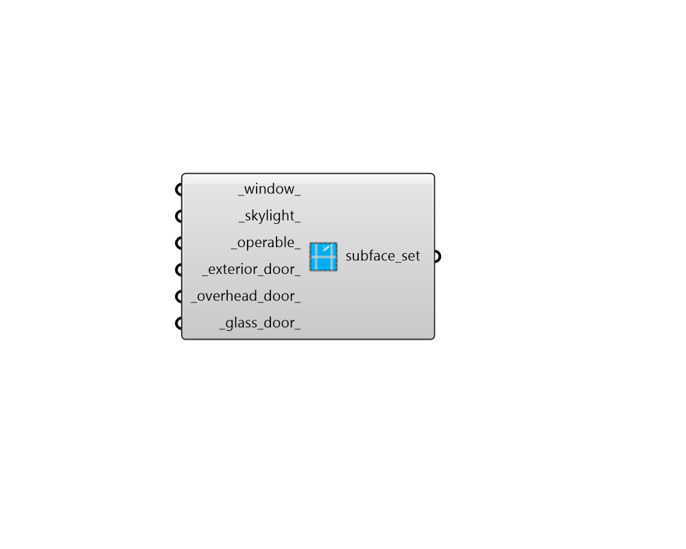

## Subface Subset

 - [[source code]](https://github.com/ladybug-tools/honeybee-grasshopper-energy/blob/master/honeybee_grasshopper_energy/src//HB%20Subface%20Subset.py)

Create a list of exterior subface (apertures + doors) constructions that can be used to edit or create a ConstructionSet object. 

#### Inputs
* ##### window 
A construction object for apertures with an Outdoors boundary condition and a Wall face type for their parent face. This can also be text for the identifier of the construction within the library. 
* ##### skylight 
A construction object for apertures with an Outdoors boundary condition and a RoofCeiling or Floor face type for their parent face. This can also be text for the identifier of the construction within the library. 
* ##### operable 
A construction object for apertures with an Outdoors boundary condition and True is_operable property. This can also be text for the identifier of the construction within the library. 
* ##### exterior_door 
A construction object for opaque doors with an Outdoors boundary condition and a Wall face type for their parent face. This can also be text for the identifier of the construction within the library. 
* ##### overhead_door 
A construction object for opaque doors with an Outdoors boundary condition and a RoofCeiling or Floor face type for their parent face. This can also be text for the identifier of the construction within the library. 
* ##### glass_door 
A construction object for all glass doors with an Outdoors boundary condition. This can also be text for the identifier of the construction within the library. 

#### Outputs
* ##### subface_set
A list of exterior subface constructions that can be used to edit or create a ConstructionSet object. 