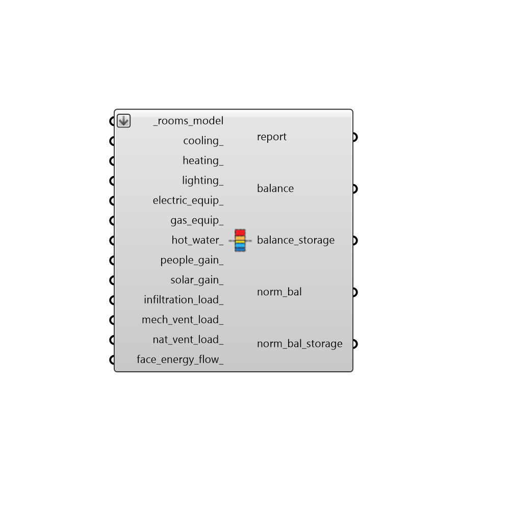

## Thermal Load Balance

 - [[source code]](https://github.com/ladybug-tools/honeybee-grasshopper-energy/blob/master/honeybee_grasshopper_energy/src//HB%20Thermal%20Load%20Balance.py)

Construct a complete thermal load balance from energy simulation results and honeybee Rooms or a Model. 

#### Inputs
* ##### rooms_model [Required]
An array of honeybee Rooms or a honeybee Model for which the thermal load balance will be computed. In most cases, these should be the Rooms or Model that are fed directly into the simulation. But this can also be a subset of such Rooms and the balance will only be computed for those Rooms. 
* ##### cooling 
Array of data collections for 'Zone Ideal Loads Supply Air Cooling Energy'. 
* ##### heating 
Array of data collections for 'Zone Ideal Loads Supply Air Heating Energy'. 
* ##### lighting 
Array of data collections for 'Zone Lights Heating Energy'. 
* ##### electric_equip 
Array of data collections for 'Zone Electric Equipment Heating Energy'. 
* ##### gas_equip 
Array of data collections for 'Zone Gas Equipment Heating Energy'. 
* ##### hot_water 
Array of data collections for 'Water Use Equipment Zone Heat Gain Energy' that correspond to the input rooms. 
* ##### people_gain 
Array of data collections for 'Zone People Heating Energy'. 
* ##### solar_gain 
Array of data collections for 'Zone Windows Transmitted Solar Radiation Energy'. 
* ##### infiltration_load 
An array of data collections for the infiltration heat loss (negative) or heat gain (positive). 
* ##### mech_vent_load 
An array of data collections for the ventilation heat loss (negative) or heat gain (positive) as a result of meeting minimum outdoor air requirements with the mechanical system. 
* ##### nat_vent_load 
An array of data collections for the natural ventilation heat loss (negative) or heat gain (positive). 
* ##### face_energy_flow 
An array of data collections for the surface heat loss (negative) or heat gain (positive). 

#### Outputs
* ##### report
... 
* ##### balance
A list of data collections where each collection represents a load balance term. This can then be plugged into the "LB Hourly Plot" or "LB Monthly Chart" to give a visualization of the load balance over all connected Rooms. 
* ##### balance_storage
The balance output plus an additional term to represent the remainder of the load balance. This term is labeled "Storage" since it typically represents the energy being stored in the building's mass. If this term is particularly large, it can indicate that not all of the load balance terms have been plugged into this component. 
* ##### norm_bal
A list of data collections where each collection represents a load balance term that has bee normalized by the Room floor area. This can then be plugged into the "LB Hourly Plot" or "LB Monthly Chart" to give a visualization of the load balance over all connected Rooms. 
* ##### norm_bal_storage
The norm_bal output plus an additional term to represent the remainder of the load balance. This term is labeled "Storage" since it typically represents the energy being stored in the building's mass. If this term is particularly large, it can indicate that not all of the load balance terms have been plugged into this component. 