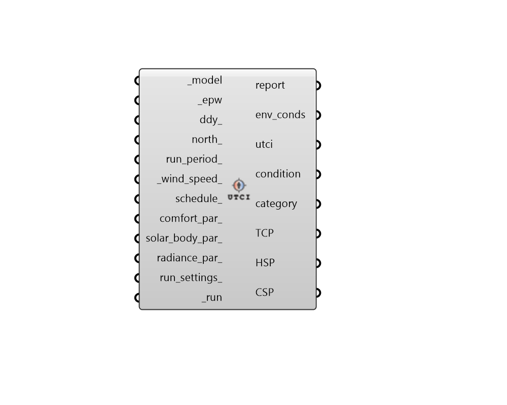

## UTCI Comfort Map

 - [[source code]](https://github.com/ladybug-tools/honeybee-grasshopper-energy/blob/master/honeybee_grasshopper_energy/src//HB%20UTCI%20Comfort%20Map.py)

Compute spatially-resolved Universal Thermal Climate Index (UTCI) and heat/cold stress conditions an EPW and Honeybee model. 

This recipe uses EnergyPlus to obtain surface temperatures and indoor air temperatures + humidities. Outdoor air temperatures, relative humidities, and air speeds are taken directly from the EPW. The energy properties of the model geometry are what determine the outcome of the simulation, though the model's Radiance sensor grids are what determine where the comfort mapping occurs. 

Longwave radiant temperatures are obtained by computing spherical view factors from each sensor to the Room surfaces of the model using Radiance. These view factors are then multiplied by the surface temperatures output by EnergyPlus to yield longwave MRT at each sensor. For outdoor sensors, each sensor's sky view is multiplied by the EPW sky temperature to account for longwave radiant exchange with the sky. All outdoor context shades and the ground are assumed to be at the EPW air temperature unless they have been modeled as Honeybee rooms. 

A Radiance-based enhanced 2-phase method is used for all shortwave MRT calculations, which precisely represents direct sun by tracing a ray from each sensor to the solar position. To determine Thermal Comfort Percent (TCP), the occupancy schedules of the energy model are used. Any hour of the occupancy schedule that is 0.1 or greater will be considered occupied. All hours of the outdoors are considered occupied. 

#### Inputs
* ##### model [Required]
A Honeybee Model for which UTCI comfort will be mapped. Note that this model should have radiance grids assigned to it in order to produce meaningful results. 
* ##### epw [Required]
Path to an EPW weather file to be used for the comfort map simulation. 
* ##### ddy [Required]
Path to a DDY file with design days to be used for the initial sizing calculation of the energy simulation. 
* ##### north 
A number between -360 and 360 for the counterclockwise difference between the North and the positive Y-axis in degrees. This can also be Vector for the direction to North. (Default: 0). 
* ##### run_period 
An AnalysisPeriod to set the start and end dates of the simulation. If None, the simulation will be annual. 
* ##### wind_speed 
A single number for meteorological wind speed in m/s or an hourly data collection of wind speeds that align with the input run_period_. This will be used for all indoor comfort evaluation. Note that the EPW wind speed will be used for any outdoor sensors. (Default: 0.5). 
* ##### solar_body_par 
Optional solar body parameters from the "LB Solar Body Parameters" object to specify the properties of the human geometry assumed in the shortwave MRT calculation. The default assumes average skin/clothing absorptivity and a human subject always has their back to the sun at a 45-degree angle (SHARP = 135). 
* ##### radiance_par 
Text for the radiance parameters to be used for ray tracing. (Default: -ab 2 -ad 5000 -lw 2e-05). 
* ##### run_settings 
Settings from the "HB Recipe Settings" component that specify how the recipe should be run. This can also be a text string of recipe settings. 
* ##### run [Required]
Set to True to run the recipe and get results. This input can also be the integer "2" to run the recipe silently. 

#### Outputs
* ##### report
Reports, errors, warnings, etc. 
* ##### utci
A folder containing CSV maps of Universal Thermal Climate Index (UTCI) temperatures for each sensor grid at each time step of the analysis. This can be connected to the "HB Read Thermal Matrix" component to parse detailed results into Grasshopper. Values are in Celsius. 
* ##### condition
A folder containing CSV maps of comfort conditions for each sensor grid at each time step of the analysis. This can be connected to the "HB Read Thermal Matrix" component to parse detailed results into Grasshopper. Values are as follows. 

    * -1 = unacceptably cold conditions

    *  0 = neutral (comfortable) conditions

    * +1 = unacceptably hot conditions
* ##### category
A folder containing CSV maps of the heat/cold stress categories for each sensor grid at each time step of the analysis. This can be connected to the "HB Read Thermal Matrix" component to parse detailed results into Grasshopper. This can be used to understand not just whether conditions are acceptable but how uncomfortably hot or cold they are. Values indicate the following. 

    * -5 = extreme cold stress

    * -4 = very strong cold stress

    * -3 = strong cold stress

    * -2 = moderate cold stress

    * -1 = slight cold stress

    *  0 = no thermal stress

    * +1 = slight heat stress

    * +2 = moderate heat stress

    * +3 = strong heat stress

    * +4 = very strong heat stress

    * +5 = extreme heat stress
* ##### TCP
Lists of values between 0 and 100 for the Thermal Comfort Percent (TCP). These can be plugged into the "LB Spatial Heatmap" component along with meshes of the sensor grids to visualize spatial thermal comfort. TCP is the percentage of occupied time where thermal conditions are acceptable/comfortable. Occupied hours are determined from the occuppancy schedules of each room (any time where the occupancy schedule is >= 0.1 will be considered occupied). Outdoor sensors are considered occupied at all times. More custom TCP studies can be done by post-processing the condition results. 
* ##### HSP
Lists of values between 0 and 100 for the Heat Sensation Percent (HSP). These can be plugged into the "LB Spatial Heatmap" component along with meshes of the sensor grids to visualize uncomfortably hot locations. HSP is the percentage of occupied time where thermal conditions are hotter than what is considered acceptable/comfortable. Occupied hours are determined from the occuppancy schedules of each room (any time where the occupancy schedule is >= 0.1 will be considered occupied). Outdoor sensors are considered occupied at all times. More custom HSP studies can be done by post-processing the condition results. 
* ##### CSP
Lists of values between 0 and 100 for the Cold Sensation Percent (CSP). These can be plugged into the "LB Spatial Heatmap" component along with meshes of the sensor grids to visualize uncomfortably cold locations. CSP is the percentage of occupied time where thermal conditions are colder than what is considered acceptable/comfortable. Occupied hours are determined from the occuppancy schedules of each room (any time where the occupancy schedule is >= 0.1 will be considered occupied). Outdoor sensors are considered occupied at all times. More custom CSP studies can be done by post-processing the condition results. 