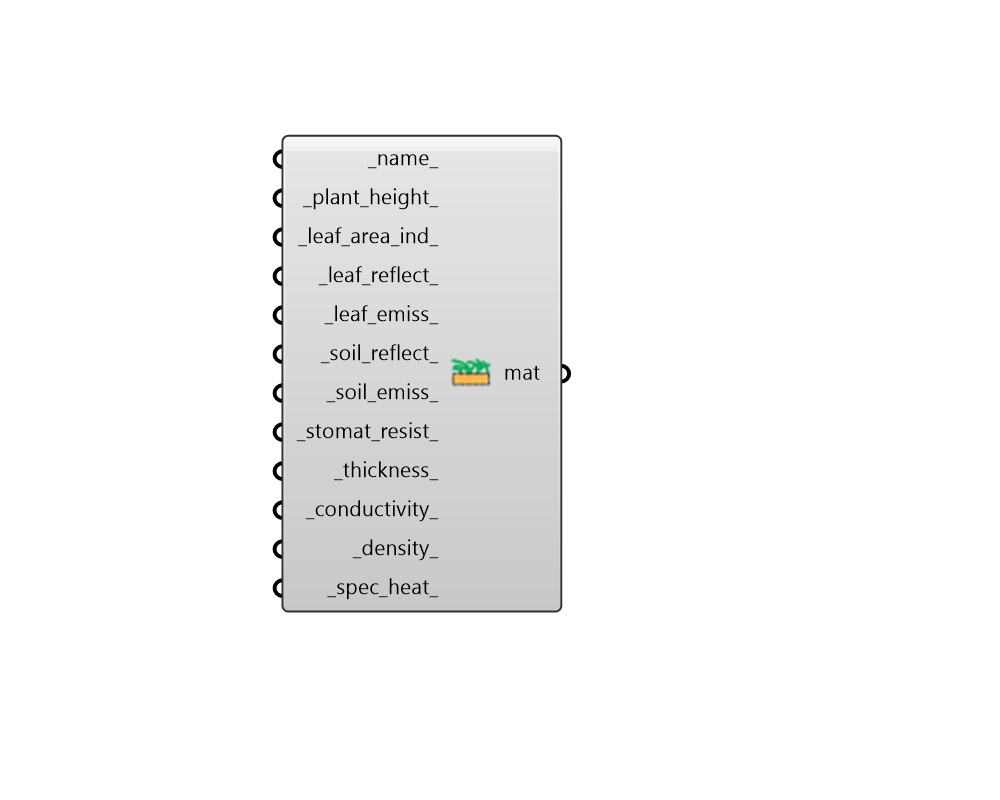

## Vegetation Material

 - [[source code]](https://github.com/ladybug-tools/honeybee-grasshopper-energy/blob/master/honeybee_grasshopper_energy/src//HB%20Vegetation%20Material.py)

Create a vegetation material representing both plants and soil, which can be plugged into the "HB Opaque Construction" component. 

Note that the underlying models for this material were developed using horizontal roofs and caution should be taken when applying ito to vertical walls. 

#### Inputs
* ##### name 
Text to set the name for the material and to be incorporated into a unique material identifier. 
* ##### plant_height 
A number between 0.005 and 1.0 for the height of plants in the vegetation layer [m]. (Default: 0.2 m). 
* ##### leaf_area_ind 
A number between 0.001 and 5.0 for the projected leaf area per unit area of soil surface (aka. Leaf Area Index or LAI). Note that the fraction of vegetation cover is calculated directly from LAI using an empirical relation. (Default: 1.0). 
* ##### leaf_reflect 
A number between 0.05 and 0.5 for the fraction of incident solar radiation that is reflected by the leaf surfaces. Solar radiation includes the visible spectrum as well as infrared and ultraviolet wavelengths. Typical values are 0.18 to 0.25. (Default: 0.22). 
* ##### leaf_emiss 
A number between 0.8 and 1.0 for the ratio of thermal radiation emitted from leaf surfaces to that emitted by an ideal black body at the same temperature. (Default: 0.95). 
* ##### soil_reflect 
A number between 0 and 1 for the fraction of incident solar radiation reflected by the soil material. (Default: 0.3). 
* ##### soil_emiss 
A number between 0 and 1 for the fraction of incident long wavelength radiation that is absorbed by the soil material. (Default: 0.9). 
* ##### stomat_resist 
A number between 50 and 300 for the resistance of the plants to moisture transport [s/m]. Plants with low values of stomatal resistance will result in higher evapotranspiration rates than plants with high resistance. (Default: 180). 
* ##### thickness 
Number for the thickness of the soil layer [m]. (Default: 0.1). 
* ##### conductivity 
Number for the thermal conductivity of the soil [W/m-K]. (Default: 0.35). 
* ##### density 
Number for the density of the soil [kg/m3]. (Default: 1100). 
* ##### spec_heat 
Number for the specific heat of the soil [J/kg-K]. (Default: 1200). 

#### Outputs
* ##### mat
A vegetation material that can be assigned to a Honeybee Opaque construction. 