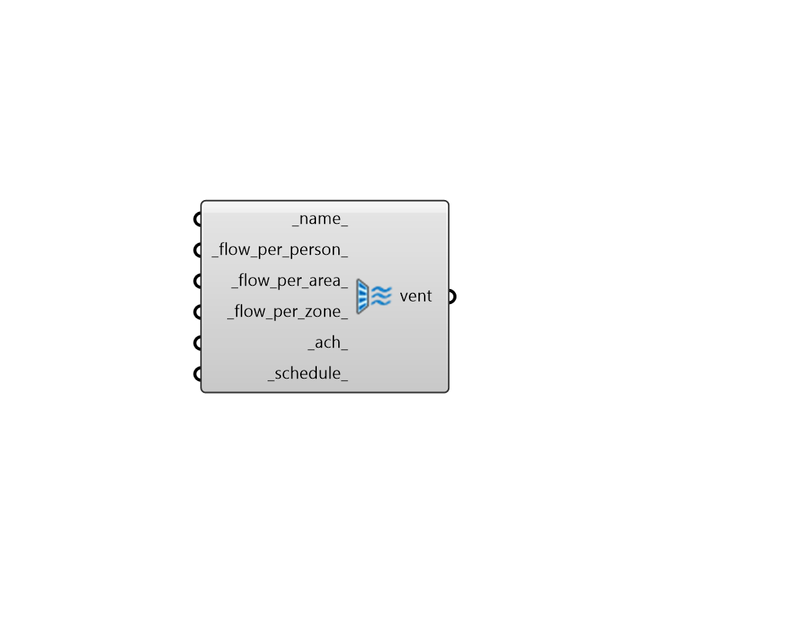

## Ventilation

 - [[source code]](https://github.com/ladybug-tools/honeybee-grasshopper-energy/blob/master/honeybee_grasshopper_energy/src//HB%20Ventilation.py)

Create a Ventilation object that can be used to create a ProgramType or be assigned directly to a Room. 

Note the the 4 ventilation types (_flow_per_person_, _flow_per_area_, _flow_per_zone_, _ach_) are ultimately summed together to yeild the ventilation design flow rate used in the simulation. 

#### Inputs
* ##### name 
Text to set the name for the Ventilation and to be incorporated into a unique Ventilation identifier. If None, a unique name will be generated. 
* ##### flow_per_person 
A numerical value for the intensity of outdoor air ventilation in m3/s per person. This will be added to the _flow_per_area_, _flow_per_zone_ and _ach_ to produce the final minimum outdoor air specification. Note that setting this value here does not mean that ventilation is varied based on real-time occupancy but rather that the minimum level of ventilation is determined using this value and the People object of the Room. To vary ventilation on a timestep basis, a ventilation schedule should be used or the dcv_ option should be selected on the HVAC system if it is available. (Default: 0). 
* ##### flow_per_area 
A numerical value for the intensity of ventilation in m3/s per square meter of floor area. This will be added to the _flow_per_person_, _flow_per_zone_ and _ach_ to produce the final minimum outdoor air specification. (Default: 0). 
* ##### flow_per_zone 
A numerical value for the design level of ventilation in m3/s for the entire zone. This will be added to the _flow_per_person_, _flow_per_area_ and _ach_ to produce the final minimum outdoor air specification. (Default: 0). 
* ##### ach 
A numberical value for the design level of ventilation in air changes per hour (ACH) for the entire zone. This will be added to the _flow_per_person_, _flow_per_area_ and _flow_per_zone_ to produce the final minimum outdoor air specification. (Default: 0). 
* ##### schedule 
An optional fractional schedule for the ventilation over the course of the year. The fractional values will get multiplied by the total design flow rate (determined from the fields above and the calculation_method) to yield a complete ventilation profile. Setting this schedule to be the occupancy schedule of the zone will mimic demand controlled ventilation. If None, a constant design level of ventilation will be used throughout all timesteps of the simulation. (Default: None). 

#### Outputs
* ##### vent
An Ventilation object that can be used to create a ProgramType or be assigned directly to a Room. 