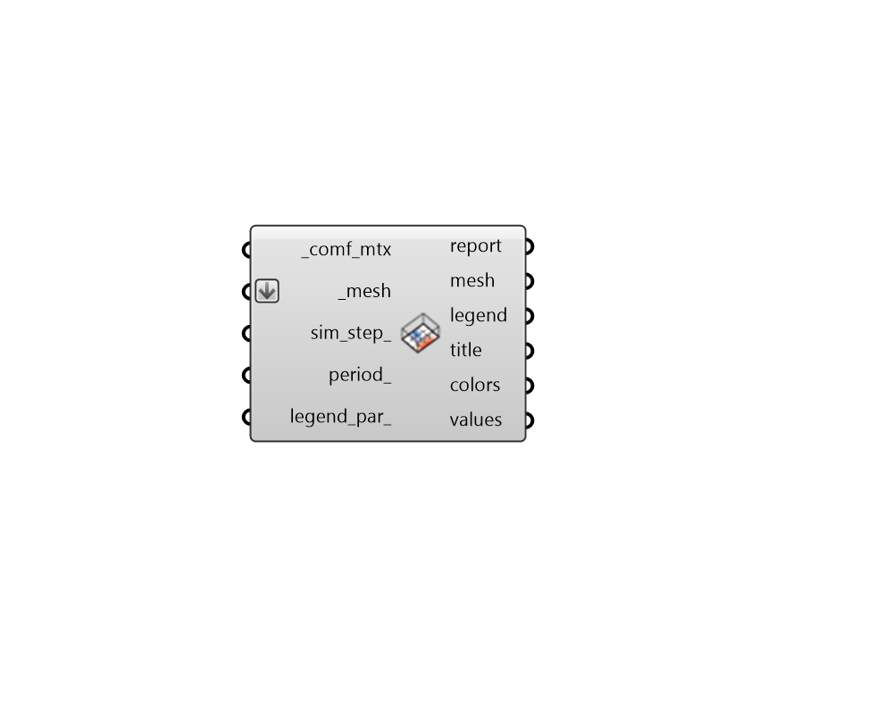

## Visualize Thermal Map

 - [[source code]](https://github.com/ladybug-tools/honeybee-grasshopper-energy/blob/master/honeybee_grasshopper_energy/src//HB%20Visualize%20Thermal%20Map.py)

Spatially visualize the detailed results of a thermal mapping analysis from a comfort matrix. 

#### Inputs
* ##### comf_mtx [Required]
A comfort Matrix object from the "HB Read Thermal Matrix" component. 
* ##### mesh [Required]
Mesh objects that correspond with the sensor grids of the thermal map analysis. These will be , with a number of faces or vertices that match the number of input values and will be colored with results. 
* ##### sim_step 
An optional integer (greater than or equal to 0) to select a specific time step of the comfort results to be displayed. Note that this will override any connected period. 
* ##### period 
A Ladybug analysis period to be applied to select a slice of time across the comfort results to be displayed. 
* ##### legend_par 
An optional LegendParameter object to change the display of the results. 

#### Outputs
* ##### report
... 
* ##### mesh
The input mesh objects colored with results. 
* ##### legend
Geometry representing the legend for the results. 
* ##### title
A text object for the title. 
* ##### colors
The colors associated with each input value. 
* ##### values
A list of numbers for each face of the mesh, which are used to generate the colors. 