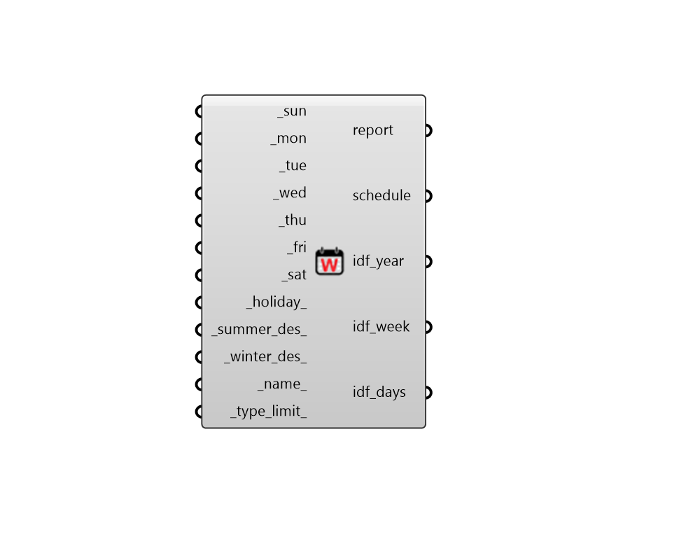

## Weekly Schedule

 - [[source code]](https://github.com/ladybug-tools/honeybee-grasshopper-energy/blob/master/honeybee_grasshopper_energy/src//HB%20Weekly%20Schedule.py)

Create a schedule from lists of daily values for each day of the week. 

#### Inputs
* ##### sun [Required]
A list of 24 values that represent the schedule values at each hour of Sunday. This can also be a single constant value for the whole day. 
* ##### mon [Required]
A list of 24 values that represent the schedule values at each hour of Monday. This can also be a single constant value for the whole day. 
* ##### tue [Required]
A list of 24 values that represent the schedule values at each hour of Tuesday. This can also be a single constant value for the whole day. 
* ##### wed [Required]
A list of 24 values that represent the schedule values at each hour of Wednesday. This can also be a single constant value for the whole day. 
* ##### thu [Required]
A list of 24 values that represent the schedule values at each hour of Thursday. This can also be a single constant value for the whole day. 
* ##### fri [Required]
A list of 24 values that represent the schedule values at each hour of Friday. This can also be a single constant value for the whole day. 
* ##### sat [Required]
A list of 24 values that represent the schedule values at each hour of Saturday. This can also be a single constant value for the whole day. 
* ##### holiday 
An optional list of 24 values that represent the schedule values at each hour of holidays. This can also be a single constant value for the whole day. If no values are input here, the schedule for Sunday will be used for all holidays. 
* ##### summer_des 
An optional list of 24 values that represent the schedule values at each hour of the summer design day. This can also be a single constant value for the whole day. If None, the daily schedule with the highest average value will be used unless the _type_limit_ is Temperature, in which case it will be the daily schedule with the lowest average value. 
* ##### winter_des 
An optional list of 24 values that represent the schedule values at each hour of the summer design day. This can also be a single constant value for the whole day. If None, the daily schedule with the lowest average value will be used unless the _type_limit_ is Temperature, in which case it will be the daily schedule with the highest average value. 
* ##### name 
Text to set the name for the Schedule and to be incorporated into a unique Schedule identifier. 
* ##### type_limit 
A text string from the identifier of the ScheduleTypeLimit to be looked up in the schedule type limit library. This can also be a custom ScheduleTypeLimit object from the "HB Type Limit" component. The input here will be used to validate schedule values against upper/lower limits and assign units to the schedule values. Default: "Fractional" for values that range continuously between 0 and 1. Choose from the following built-in options: 

    * Fractional

    * On-Off

    * Temperature

    * Activity Level

    * Power

    * Humidity

    * Angle

    * Delta Temperature

    * Control Level

#### Outputs
* ##### report
Reports, errors, warnings, etc. 
* ##### schedule
A ScheduleRuleset object that can be assigned to a Room, a Load object, or a ProgramType object. 
* ##### idf_year
Text string for the EnergyPlus ScheduleYear that will ultimately be written into the IDF for simulation. This can also be used to add the schedule to the schedule library that is loaded up upon the start of Honeybee by copying this text into the honeybee/library/schedules/ user_library.idf file along with the other idf text outputs. 
* ##### idf_week
Text string for the EnergyPlus ScheduleWeek that will ultimately be written into the IDF for simulation. This can also be used to add the schedule to the schedule library that is loaded up upon the start of Honeybee by copying this text into the honeybee/library/schedules/ user_library.idf file along with the other idf text outputs. 
* ##### idf_days
Text strings for the EnergyPlus SchedulDays that will ultimately be written into the IDF for simulation. This can also be used to add the schedule to the schedule library that is loaded up upon the start of Honeybee by copying this text into the honeybee/library/schedules/ user_library.idf file along with the other idf text outputs. 