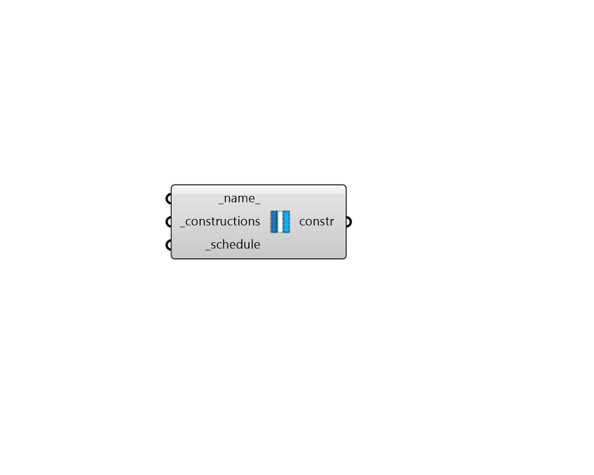

## Window Construction Dynamic

 - [[source code]](https://github.com/ladybug-tools/honeybee-grasshopper-energy/blob/master/honeybee_grasshopper_energy/src//HB%20Window%20Construction%20Dynamic.py)

Create an EnergyPlus window construction with any number of dynamic states. 

#### Inputs
* ##### name 
Text to set the name for the Construction and to be incorporated into a unique Construction identifier. 
* ##### constructions [Required]
List of materials in the construction (from exterior to interior). These materials can be either fully-detailed material objects built with the material components or text for a material identifier to be looked up in the window material library. Note that a native Grasshopper "Merge" component can be used to help order the materials correctly for the input here. 
* ##### schedule [Required]
A control schedule that dictates which constructions that are active at given times throughout the simulation. Inputs can be either the identifiers of schedules within the library or custom schedules made with any of the honeybee schedule components. The values of the schedule should be intergers and range from 0 to one less then the number of constructions. Zero indicates that the first construction is active, one indicates that the second on is active, etc. The schedule type limits of this schedule should be "Control Level." If building custom schedule type limits that describe a particular range of states, the type limits should be "Discrete" and the unit type should be "Mode," "Control," or some other fractional unit. 

#### Outputs
* ##### constr
A dynamic window construction that can be assigned to Honeybee Apertures or ConstructionSets. 