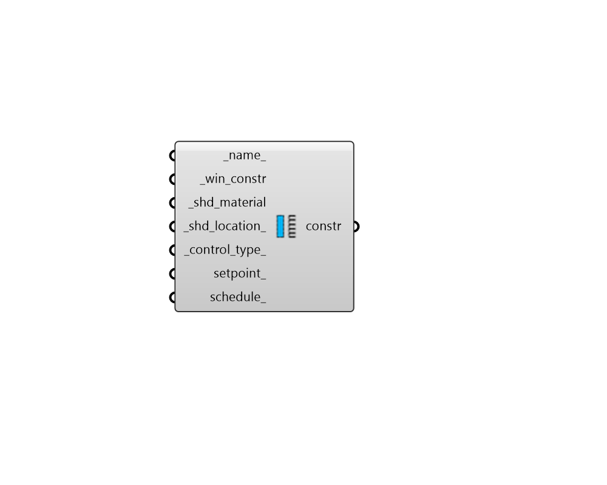

## Window Construction Shade

 - [[source code]](https://github.com/ladybug-tools/honeybee-grasshopper-energy/blob/master/honeybee_grasshopper_energy/src//HB%20Window%20Construction%20Shade.py)

Create an EnergyPlus window construction that includes shades/blinds or a dynamically- controlled glass pane. 

The result can be assigned to any Aperture or ConstructionSet just like any other WindowConstruction. 

#### Inputs
* ##### name 
Text to set the name for the Construction and to be incorporated into a unique Construction identifier. 
* ##### win_constr [Required]
A WindowConstruction object that serves as the "switched off" version of the construction (aka. the "bare construction"). The shade material and shade location will be used to modify this starting construction. This can also be text for a construction identifier to be looked up in the window construction library. 
* ##### shd_material [Required]
An Shade Material or an Blind Material that serves as the shading layer for this construction. This can also be a Glass Material, which will indicate that the WindowConstruction has a dynamically- controlled glass pane like an electrochromic window assembly. This can also be text for a material identifier to be looked up in the window material library. 
* ##### shd_location 
Text to indicate where in the window assembly the shade material is located. (Default: "Interior"). Choose from the following 3 options: 

    * Interior

    * Between

    * ExteriorNote that the WindowConstruction must have at least one gas gap to use the "Between" option. Also note that, for a WindowConstruction with more than one gas gap, the "Between" option defalts to using the inner gap as this is the only option that EnergyPlus supports. 
* ##### control_type 
An integer or text to indicate how the shading device is controlled, which determines when the shading is “on” or “off.” (Default: "AlwaysOn"). Choose from the options below (units for the values of the corresponding setpoint are noted in parentheses next to each option): 0 = AlwaysOn 1 = OnIfHighSolarOnWindow (W/m2) 2 = OnIfHighHorizontalSolar (W/m2) 3 = OnIfHighOutdoorAirTemperature (C) 4 = OnIfHighZoneAirTemperature (C) 5 = OnIfHighZoneCooling (W) 6 = OnNightIfLowOutdoorTempAndOffDay (C) 7 = OnNightIfLowInsideTempAndOffDay (C) 8 = OnNightIfHeatingAndOffDay (W) 
* ##### setpoint 
A number that corresponds to the specified control_type. This can be a value in (W/m2), (C) or (W) depending upon the control type. 
* ##### schedule 
An optional ScheduleRuleset or ScheduleFixedInterval to be applied on top of the control type. If None, the control type will govern all behavior of the construction. 

#### Outputs
* ##### constr
A shaded window construction that can be assigned to Honeybee Apertures or ConstructionSets. 