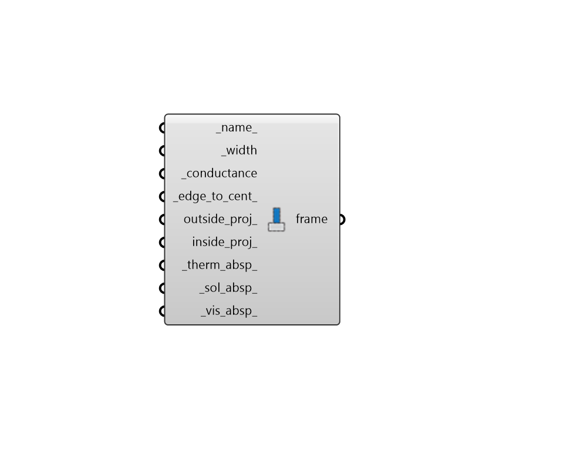

## Window Frame

 - [[source code]](https://github.com/ladybug-tools/honeybee-grasshopper-energy/blob/master/honeybee_grasshopper_energy/src//HB%20Window%20Frame.py)

Create a window frame matrial that can be assigned to a Window Construction by plugging it into the frame_ input of the "HB Window Construction" component. 

#### Inputs
* ##### name 
Text to set the name for the material and to be incorporated into a unique material identifier. 
* ##### width [Required]
Number for the width of frame in plane of window [m]. The frame width is assumed to be the same on all sides of window. 
* ##### conductance [Required]
Number for the thermal conductance of the frame material measured from inside to outside of the frame surface (no air films) and taking 2D conduction effects into account [W/m2-K]. Values for typical frame materials are as follows. 

    * Aluminum with Thermal Break - 56.4 W/m2-K

    * Aluminum One-Sided (Flush) - 10.7 W/m2-K

    * Wood - 3.5 W/m2-K

    * Vinyl - 2.3 W/m2-K
* ##### edge_to_cent 
Number between 0 and 4 for the ratio of the glass conductance near the frame (excluding air films) divided by the glass conductance at the center of the glazing (excluding air films). This is used only for multi-pane glazing constructions. This ratio should usually be greater than 1.0 since the spacer material that separates the glass panes is usually more conductive than the gap between panes. A value of 1 effectively indicates no spacer. Values should usually be obtained from the LBNL WINDOW program so that the unique characteristics of the window construction can be accounted for. (Default: 1). 
* ##### outside_proj 
Number for the distance that the frame projects outward from the outside face of the glazing [m]. This is used to calculate shadowing of frame onto glass, solar absorbed by the frame, IR emitted and absorbed by the frame, and convection from frame. (Default: 0). 
* ##### inside_proj 
Number for the distance that the frame projects inward from the inside face of the glazing [m]. This is used to calculate solar absorbed by the frame, IR emitted and absorbed by the frame, and convection from frame. (Default: 0). 
* ##### therm_absp 
A number between 0 and 1 for the fraction of incident long wavelength radiation that is absorbed by the material. (Default: 0.9). 
* ##### sol_absp 
A number between 0 and 1 for the fraction of incident solar radiation absorbed by the material. (Default: 0.7). 
* ##### vis_absp 
A number between 0 and 1 for the fraction of incident visible wavelength radiation absorbed by the material. Default value is the same as the _sol_absp_. 

#### Outputs
* ##### frame
A window frame material that can be assigned to a Honeybee Window construction. 