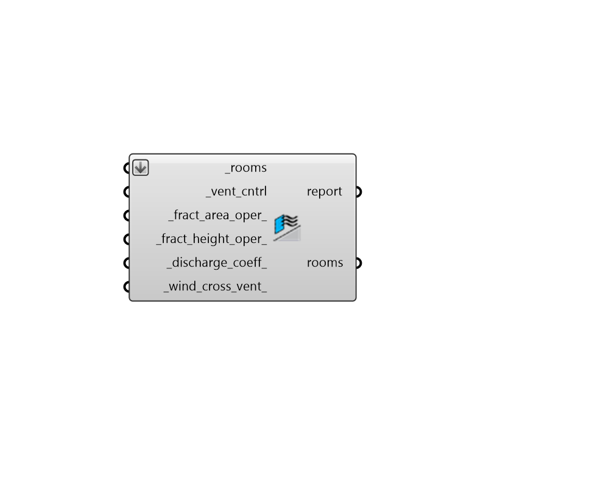

## Window Opening

 - [[source code]](https://github.com/ladybug-tools/honeybee-grasshopper-energy/blob/master/honeybee_grasshopper_energy/src//HB%20Window%20Opening.py)

Define the window opening properties for all operable apertures of a Room. 

By default, the properties assigned by this component are translated into simple ZoneVentilation objects in the resulting IIDF, which can approximate airflow from both single-sided bouyancy-driven ventilation as well as wind-driven cross ventilation. Bouyancy-driven flow can happen for essentially all openings while wind-driven flow can only happen when there are pressure differences across windows on opposite sides of a Room. 

Simple ZoneVentilation is computed using the following formulas: 

VentilationWind = WindCoefficient * OpeningArea * Schedule * WindSpeed VentilationStack = StackDischargeCoefficient * OpeningArea * ScheduleValue *      SQRT(2 * GravityAccelration * HeightNPL * (|(TempZone - TempOutdoors)| / TempZone))  TotalVentilation = SQRT((VentilationWind)^2 + (VentilationStack)^2) 

Note that the (OpeningArea) term is derived from the _fract_area_oper_ and the area of each aperture while the (HeightNPL) term is derived from the _fract_height_oper_ and the height of each aperture.  The "NPL" stands for "Neutral Plane" and the whole term represents the height from midpoint of lower opening to the neutral pressure level of the window (computed as 1/4 of the height of each Aperture in the translation from honeybee to IDF). 

More complex airflow phenomena can be modeled by using this component in conjunction with with the Airflow Network (AFN) component. Note that the window opening properties assigned by this component are still relevant for such AFN simulations. 

#### Inputs
* ##### rooms [Required]
Honeybee Room objects to which window ventilation opening properties will be assigned. Note that this component only assigns such properties to operable Apertures on the rooms. If the is_operable property of any of a room's apertures is not True, no opening properties will be assigned. 
* ##### vent_cntrl [Required]
A Ventilation Control object from the "HB Ventilation Control" component, which dictates the opening behaviour of the Room's apertures. 
* ##### fract_area_oper 
A number between 0.0 and 1.0 for the fraction of the window area that is operable. (Default: 0.5, typical of sliding windows). 
* ##### fract_height_oper 
A number between 0.0 and 1.0 for the fraction of the distance from the bottom of the window to the top that is operable. (Default: 1.0, typical of windows that slide horizontally). 
* ##### discharge_coeff 
A number between 0.0 and 1.0 that will be multipled by the area of the window in the stack (buoyancy-driven) part of the equation to account for additional friction from window geometry, insect screens, etc. (Default: 0.45, for unobstructed windows with insect screens). This value should be lowered if windows are of an awning or casement type and not allowed to fully open. Some common values for this coefficient include the following. 

    * 0.0 - Completely discount stack ventilation from the calculation.

    * 0.45 - For unobstructed windows with an insect screen.

    * 0.65 - For unobstructed windows with NO insect screen.
* ##### wind_cross_vent 
Boolean to indicate if there is an opening of roughly equal area on the opposite side of the Room such that wind-driven cross ventilation will be induced. If False, the assumption is that the operable area is primarily on one side of the Room and there is no wind-driven ventilation. If None, the normal vectors of the operable aperturs of the input _rooms will be analyzed. If window normals of a given room are found to have an angle difference greater than 90 degrees, cross ventilation will be set to True. Otherwise, it will be False. 

#### Outputs
* ##### report
... 
* ##### rooms
The input Honeybee Rooms with their window-opening properties edited. 